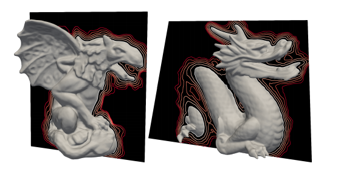
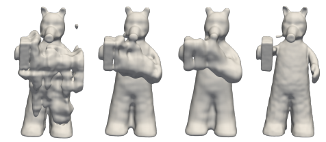
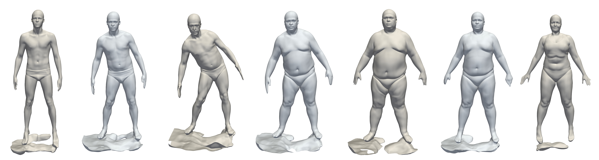

# IGR: Implicit Geometric Regularization for Learning Shapes with Phase Loss and Fourier Layer
<p align="center">
  
</p>

This repository contains an implementation to the paper: "Phase transitions distance functions and implicit neural representations".

Representing surfaces as zero level sets of neural
networks recently emerged as a powerful modeling paradigm, named Implicit Neural Representations (INRs), serving numerous downstream
applications in geometric deep learning and 3D vision. Training INRs previously required choosing
between occupancy and distance function representation and different losses with unknown limit
behavior and/or bias. In this paper we draw inspiration from the theory of phase transitions of fluids and suggest a loss for training INRs that learns
a density function that converges to a proper occupancy function, while its log transform converges
to a distance function. Furthermore, we analyze
the limit minimizer of this loss showing it satisfies
the reconstruction constraints and has minimal
surface perimeter, a desirable inductive bias for
surface reconstruction. Training INRs with this
new loss leads to state-of-the-art reconstructions
on a standard benchmark.

For more details:

paper: https://arxiv.org/pdf/2106.07689.pdf


## Installation Requirmenets
The code is compatible with python 3.7 and pytorch 1.2. In addition, the following packages are required:  
numpy, pyhocon, plotly, scikit-image, trimesh.

## Usage


### Surface reconstruction
<p align="center">
  
</p>

IGR can be used to reconstruct a single surface given a point cloud with or without normal data. Adjust reconstruction/setup.json to the
path of the input 2D/3D point cloud:
```
train
{
  ...
  d_in=D
  ...
  input_path = your_path
  ...
}
```
Where D=3 in case we use 3D data or 2 if we use 2D. We support xyz,npy,npz,ply files.

Then, run training:
```
cd ./code
python reconstruction/run.py 
```
Finally, to produce the meshed surface, run:
```
cd ./code
python reconstruction/run.py --eval --checkpoint CHECKPOINT
```
where CHECKPOINT is the epoch you wish to evaluate of 'latest' if you wish to take the most recent epoch.


### Learning shapespace from the D-Faust oriented point clouds
<p align="center">
  
</p>

#### Data
The raw scans can be downloaded from http://dfaust.is.tue.mpg.de/downloads.
In order to sample point clouds with normals use:

```
cd ./code
python preprocess/dfaust.py --src-path SRC_PATH --out-path OUT_PATH
```
where SRC_PATH is the absoule path of the directory with the original D-Faust scans, and OUT_PATH is the absolute path
of the directory on which you wish to output the processed point clouds.

It is also possible to process only train
data with input --mode 0 our only test with --mode 1.
 
In case you wish to only process part of the data (e.g. for parallel processing) it is possible by adding --names NAME_1,NAME_2,...,NAME_k where NAME_i 
is one of D-Faust shapes e.g. 50002, 50020.

After preprocessing ended adjust the file ./shapespace/dfaust_setup.conf to the cur path of the data:
```
train
{
  ...
  dataset_path = OUT_PATH/dfaust_processed
  ...
}
```

#### Predicting meshed surfaces with IGR pretrained network
We have uploaded IGR trained network. To produce predictions on unseen test scans, run:
```
cd ./code
python shapespace/eval.py --checkpoint 1200 --exp-name dfaust_pretrained --split dfaust/test_all.json --exps-dir trained_models
```
In case you wish to generate less models you can use --split dfaust/test_models.json

#### Interpolating latents of IGR pretrained network
To meshs of latent interpolation between two shapes use:
```
cd ./code
python shapespace/interpolate.py --interval INTERVAL --checkpoint 1200 --exp-name dfaust_pretrained --exps-dir trained_models
```
Where INTERVAL is the number (int) linspace of latent interpolations.

In case you wish to interpolate different shapes adjust the file dfaust/interpolation.json
 
#### Training
If you want to train IGR yourself, run:
```
cd ./code
python shapespace/train.py
```

## Citation
If you find our work useful in your research, please consider citing:

    @misc{lipman2021phase,
      title={Phase Transitions, Distance Functions, and Implicit Neural Representations}, 
      author={Yaron Lipman},
      year={2021},
      eprint={2106.07689},
      archivePrefix={arXiv},
      primaryClass={cs.LG}
}
    	
## Code Reference from
https://github.com/amosgropp/IGR/tree/master/code